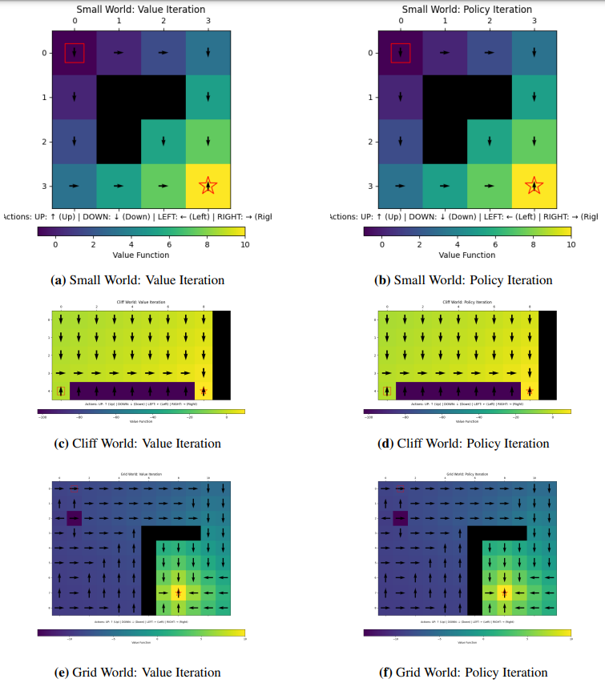

# MLMI7-Reinforcement-Learning - University-of-Cambridge

Coursework project for MLMI7 - Reinforcement Learning and Decision Making @ the University of Cambridge 🏫

## 📕 Abstract

This assignment aims to implement basic Reinforcement Learning algorithms such as Value and Policy Iteration, SARSA, Expected-SARSA and Q-Learning for discrete grid-world models on evaluate their performance and relevance on different tasks. We also discuss the impact of hyperparameters and the choice of algorithms on the performance of the agent as well as the relevance of using non-linear function approximators such as neural networks to solve more complex tasks.

## 🗞️ Report

The report is accessible [here](d)

## 💻 Description

The project is run in a Jupyter Notebook environment. The main file is `main.ipynb` which contains the implementation of the algorithms and the evaluation of the agent on different tasks.

You can plot the following:

**Value function and policy**:

**Convergence**

**Reward per episode**

